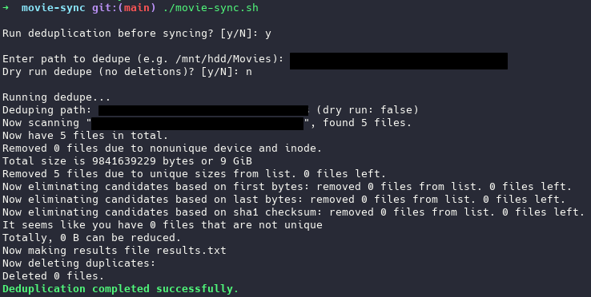
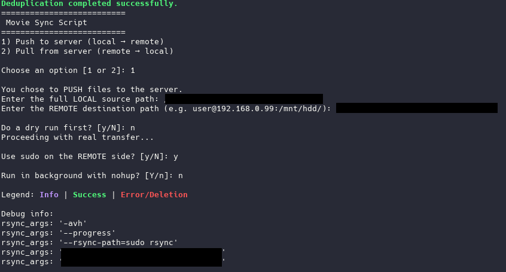

# Movie Sync

**Can be used on any files, not just movies! (that totally aren't on a hosting site on a server somewhere...)**

A bash script to **deduplicate** and **sync** directories between local and remote machines. Easy UI in the terminal to simplify user transfers.

**Do you**

- Hate downloading/using another program to only FTP?
- Having duplicates in your data?
- Need to move files from your local to a remote server?

Well strap in because Movie Sync has got you covered!

---

## Features

- Deduplicate files in a directory using [`rdfind`](https://github.com/paulharry/rdfind) with optional dry-run and logging
- Sync files **to** or **from** a remote server using `rsync` with optional dry-run, sudo on remote, background execution, and logging
- All functionality combined in a single interactive script
- Logging for both deduplication and sync controlled by a single `--log` CLI flag

---

## Requirements

- Linux/macOS with bash shell
- [`rdfind`](https://github.com/paulharry/rdfind) installed and available in `$PATH`
- `rsync` installed
- SSH access configured for remote sync
- Optional: `sudo` rights on remote machine if you want to sync using remote sudo

---

## Usage

Make the script executable:

```bash
chmod +x movie-sync.sh
```

Run the script:

```bash
./movie-sync.sh [--log]
```

- Use `--log` to enable logging of dedupe and rsync output to timestamped log files.
- Without `--log`, no logs are saved.

The script will prompt you to:

1. Run deduplication (yes/no) and configure dry-run for dedupe
2. Choose Push (local → remote) or Pull (remote → local) mode
3. Enter source and destination paths
4. Choose dry-run for sync
5. Use sudo on remote side (yes/no)
6. Run sync in background (yes/no)

---

## Logs

If logging is enabled with `--log`:

- Deduplication logs are saved as `dedupe_YYYY-MM-DD_HH-MM-SS.txt`
- Rsync logs are saved as `movie_sync_YYYY-MM-DD_HH-MM-SS.log`

---

## Example

Run with logging enabled:

```bash
./movie-sync.sh --log
```

Sample interaction:

```
Run deduplication before syncing? [y/N]: y
Enter path to dedupe (e.g. /mnt/hdd/): /mnt/hdd/
Dry run dedupe (no deletions)? [y/N]: y

Choose an option [1 or 2]: 1
Enter the full LOCAL source path: /mnt/hdd/
Enter the REMOTE destination path (e.g. user@host:/path): user@192.168.0.2:/mnt/backup/Movies
Do a dry run first? [y/N]: n
Use sudo on the REMOTE side? [y/N]: n
Run in background with nohup? [Y/n]: n
```

---

## Screenshots

**Deduplication (Dry Run):**



**Rsync Syncing to Remote:**



---

## License

MIT License — see [LICENSE](LICENSE) file.

---

## Contributions & Issues

Feel free to open issues or pull requests to improve the script!

---

Enjoy syncing your files hassle-free! 🎬🚀
